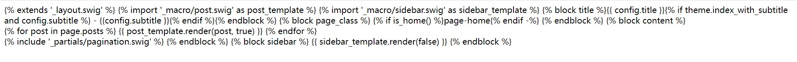

# iesimple.github.io

## resource

- [hexo doc](https://hexo.io/zh-cn/docs/)
- [next theme](https://github.com/theme-next/hexo-theme-next/blob/master/docs/zh-CN/INSTALLATION.md)

## problem

1. 修改主题之后出现

  

  缺少swig，需要手动安装

  ```shell
  npm i hexo-renderer-swig
  cnpm i hexo-renderer-swig	# 网上教程很多有使用淘宝源的，因为npm不好用
  ```

2. 

## Log

6.8 博客框架搭建